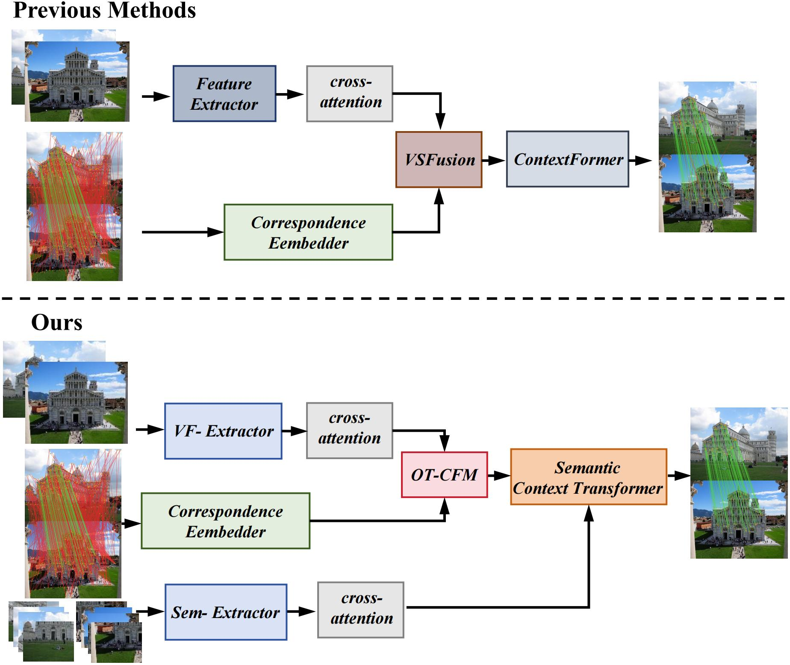

# MAVS-Net: Modality-Aware Visual-Spatial Fusion Network for Two-View Correspondence Learning

Official implementation of **MAVS-Net: Modality-Aware Visual-Spatial Fusion Network for Two-View Correspondence Learning**.


## Introduction

**MAVS-Net** is a novel modality-aware visual-spatial fusion network for robust two-view correspondence pruning. It introduces **Optimal Transport** theory for the first time to enforce mathematically grounded cross-modal alignment between visual and spatial features.
<div align=center></div>

### Key Contributions

- **Optimal Transport Cross-Modal Fusion (OT-CFM)**: Formulates visual-spatial feature interaction as an optimal assignment problem solved via the Sinkhorn algorithm, enforcing doubly stochastic alignment to suppress ambiguous cross-modal mappings.

- **Semantic-Gated Graph Attention (SGGA)**: Leverages high-level semantic priors extracted by a Vision Transformer (ViT) to actively modulate KNN graph topologies via point-wise semantic affinity gating, resolving spatial-semantic conflicts where spatially adjacent correspondences belong to disparate physical entities.

- **State-of-the-Art Performance**: Achieves **65.87%** and **23.91% mAP@5°** on YFCC100M and SUN3D unknown scenes respectively without RANSAC post-processing.

## Architecture

<div align=center></div>

The MAVS-Net framework integrates four core components:

1. **VF-Extractor** (Visual Feature Extractor): ResNet34 backbone with cross-attention to extract environmental visual cues from two-view images.

2. **Sem-Extractor** (Semantic Extractor): ViT backbone with cross-attention to capture high-level semantic priors that guide graph topology modulation.

3. **OT-CFM** (Optimal Transport Cross-Modal Fusion): Sinkhorn-based optimal transport for mathematically rigorous alignment of visual and spatial features with learnable modality identity biases.

4. **Semantic Context Transformer** (×2 iterations): Integrates SGGA-based local graph attention with global transformer context aggregation. The first iteration (k=9) prunes correspondences; the second (k=6) predicts inlier probabilities and estimates the essential matrix.

## Results

### Camera Pose Estimation (mAP@5°)

| Method | YFCC100M Known | YFCC100M Unknown | SUN3D Known | SUN3D Unknown |
|--------|:------------:|:--------------:|:---------:|:-----------:|
| VSFormer | 48.83 | 62.18 | 24.81 | 20.18 |
| DeMo | 49.85 | 63.06 | 25.43 | 20.96 |
| SC-Net | 51.74 | 64.38 | 26.95 | 22.74 |
| **MAVS-Net (Ours)** | **52.93** | **65.87** | **28.42** | **23.91** |

### Outlier Removal (F-score %)

| Method | YFCC100M Known | YFCC100M Unknown | SUN3D Known | SUN3D Unknown |
|--------|:------------:|:--------------:|:---------:|:-----------:|
| SC-Net | 82.82 | 80.06 | 72.49 | 68.25 |
| **MAVS-Net (Ours)** | **84.49** | **81.61** | **74.68** | **70.24** |

## Requirements

### Installation

We recommend using Anaconda or Miniconda. To set up the environment:

```bash
conda create -n mavs_net python=3.8 --yes
conda activate mavs_net
conda install pytorch==1.7.1 torchvision==0.8.2 cudatoolkit=11.0 -c pytorch --yes
python -m pip install -r requirements.txt
```

### Dataset

Follow the instructions provided [here](https://github.com/zjhthu/OANet) for downloading and preprocessing datasets.

The packaged dataset should be placed in the `data_dump/` directory with the following structure:

```
$MAVS-Net
    |----data_dump
      |----yfcc-sift-2000-train.hdf5
      |----yfcc-sift-2000-val.hdf5
      |----yfcc-sift-2000-test.hdf5
      ...
```

## Training & Evaluation

### 1. Single GPU Training

```bash
# Train by single GPU
nohup python -u train_single_gpu.py >./logs/mavs_net_yfcc.txt 2>&1 &
```

### 2. Multi GPU Training

```bash
# Train by multiple GPUs
CUDA_VISIBLE_DEVICES=0,1 nohup python -u -m torch.distributed.launch --nproc_per_node=2 --use_env train_multi_gpu.py >./logs/mavs_net_yfcc.txt 2>&1 &
```

### 3. Training with Real-Time Monitoring

```bash
python train_with_monitor.py --batch_size 20 --epochs 29
```

TensorBoard is started automatically. View training curves at:

```bash
tensorboard --logdir=runs
```

### 4. Recommended: Train with Screen (Persistent Background Execution)

```bash
# Install screen if not already installed
sudo apt-get install screen

# Start a screen session
screen -S mavs_net

# Run training
python train_with_monitor.py --batch_size 20 --epochs 29 --screen

# Detach: Ctrl+A, then D
# Reattach: screen -r mavs_net
```

### 5. Evaluation

```bash
python test.py
```

## Project Structure

```
MAVS-Net/
├── config.py                  # Configuration file
├── train_single_gpu.py        # Single GPU training script
├── train_multi_gpu.py         # Multi-GPU distributed training script
├── train_with_monitor.py      # Training with real-time monitoring
├── test.py                    # Evaluation script
├── requirements.txt           # Python dependencies
├── README.md                  # This file
├── models/
│   ├── mavs_net.py            # Core MAVS-Net architecture
│   ├── loss.py                # Loss functions (classification + essential)
│   ├── vanilla_transformer.py # Transformer layers
│   ├── resnet34.py            # ResNet34 backbone
│   └── __init__.py
├── datasets/
│   ├── CorresDataset.py       # Correspondence dataset loader
│   └── __init__.py
├── utils/
│   ├── train_eval_utils.py    # Training and evaluation utilities
│   ├── test_utils.py          # Testing utilities
│   ├── tools.py               # Helper functions
│   ├── distributed_utils.py   # Distributed training utilities
│   └── __init__.py
├── dump_match/                # Data preprocessing scripts
├── data_dump/                 # Dataset directory
├── logs/                      # Training logs
├── runs/                      # TensorBoard logs
├── checkpoint/                # Model checkpoints
├── best_model/                # Best model weights
└── weights/                   # Pre-trained weights
```

## Citation

If you find this work useful in your research, please consider citing:

```bibtex
@article{li2025mavs,
  title={MAVS-Net: Modality-Aware Visual-Spatial Fusion Network for Two-View Correspondence Learning},
  author={Li, Zihan and Zhao, Zhihao},
  journal={IEEE Access},
  year={2025},
  doi={10.1109/ACCESS.2025.XXXXXXX}
}
```

## Acknowledgment

This project builds upon excellent prior works including [OANet](https://github.com/zjhthu/OANet), [CLNet](https://github.com/sailor-z/CLNet), and [VSFormer](https://arxiv.org/abs/2312.08774). We thank the authors for their contributions to the community.

## License

This project is released under the MIT License. See [LICENSE](LICENSE) for details.
